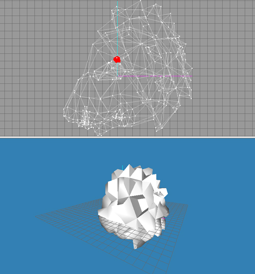
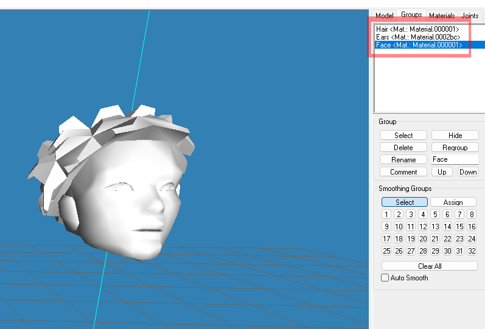
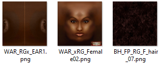
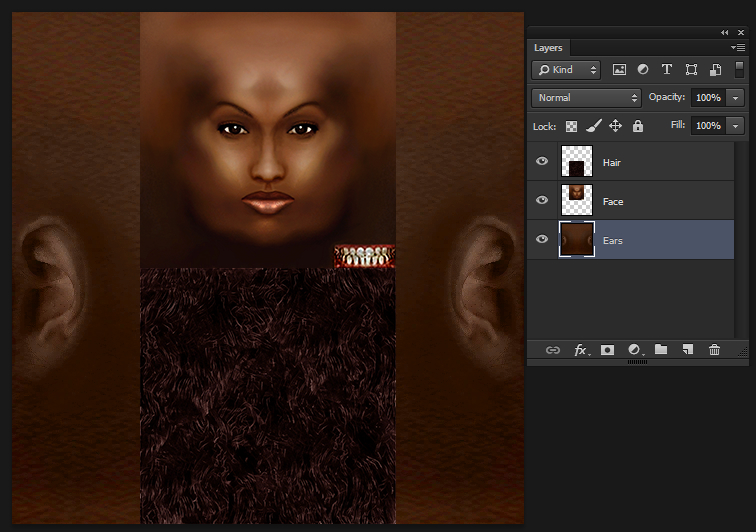
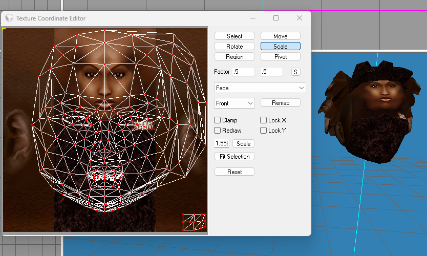
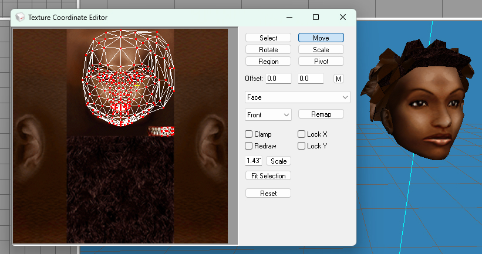
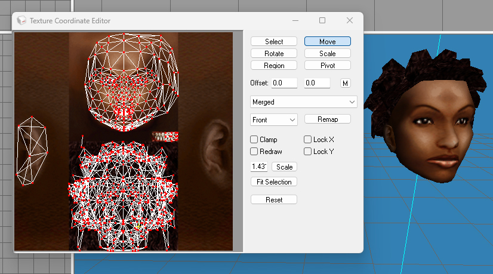
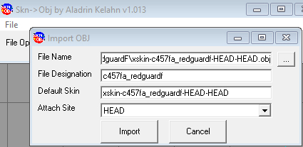
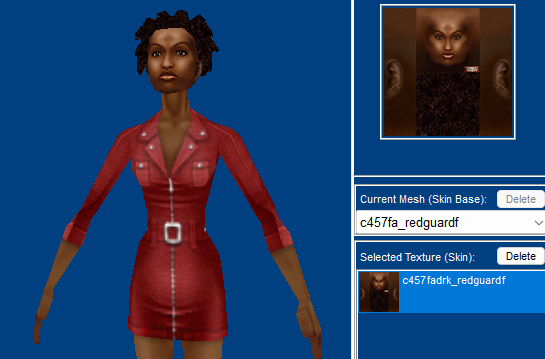
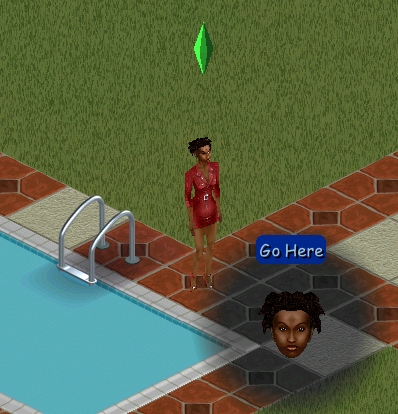

# Readying the Mesh
To create a new head, you'll need a mesh! I always convert my meshes from other video games (usually *The Sims 2*). 
Today I'll be taking a head mesh from a mod for *The Elder Scrolls III: Morrowind* and converting it to *The Sims 1*. I won't be covering how to extract meshes from any games here. I already have my meshes and textures ready to go, so I'll import the meshes into my 3D program. You can use Blender or Milkshape for this step. I'll use Milkshape.  
  
There's already a couple big problems: The head is facing downward, and it's huge. So I've also imported another mesh for size reference. See that red spot in the middle? That's about the size and orientation we need our mesh to be. This is where Blender would come in handy, if you want. It's a lot easier and quicker to resize the head mesh in Blender.  
  
Now our mesh is a much nicer size. But theres another problem: This mesh is actually three separate meshes. One for the head, one for the ears, and one for the hair. Each of these mesh parts has its own texture, too. So we'll need to combine these three meshes into one single mesh, and likewise combine the three textures into one single texture. If we left these meshes separate, we'd need a separate .SKN file for each mesh part, and the .CMX file would get complicated fast. I only ever recommend having separate mesh parts for a head that has accessories, such as glasses or a hat.    
   
So now I'm going to go into photoshop and create the texture for the head. Here's the three textures I'll need to combine. The ears texture has a lot of empty space, so I'll be arranging the face and hair texture on top of the texture for the ears. Maxis head textures are 128x128, but I usually make my textures 256x256. The ear texture is 512x512, so I'll resize the face and hair to be 256x256, fit them on the 512x512 canvas, and then resize the whole image to 256x256.  
 
At this point, we also need to pick what we're going to name our files. [See this page for naming conventions!](skn2objcxm.md) I've picked the numbers `457`, the mesh is for female adults, and the name `redguardf`, so my mesh group will be `c457fa_redguardf`. Sims 1 only has three skintones to choose from: light, medium, and dark. Redguards have dark skin, so the texture will be named `c457fadrk_redguardf.bmp`. Usually I make my heads avilable for all three skintones, but since this is a specific head from a specific game, I only have one skin texture to work with. If I had a texture for the medium and light skin swatches, they would be called `c457famed_redguardf.bmp` for the medium skin, and `c457falgt_redguardf.bmp` for the light skin swatch. Simple as that!  
  
Now that our textures are all on the same image, we are going to export the texture as an **indexed BMP**. In Photoshop, you go to Image/Mode/Indexed Color and it should be 256. Sims 1 can only use this type of BMP for the textures in-game. If they are not Indexed BMPs, they *will* show correctly in The Sims Creator, but not in the game! If your texture is the wrong format, it will show up in-game as blank and pure white instead of the correct texture. Save your new indexed image as a bmp file called `c457fadrk_redguardf.bmp`  

Now that our texture is ready, it's time to fix the UV map. I'm going to add this new texture we created onto each one of the mesh parts, and then adjust the UV map as necessary. Ctrl + T is the shortcut to open the UV editor in Milkshape. Then I'll resize the face and hair UV by half and move them into place to fit the new texture.   

Before:  
   
After:  
  
Now that the UV maps are fixed, I can combine all three mesh parts into one single mesh, and the UV maps will combine as well, creating one mesh that is mapped to one texture. Here it is!:  
   
Our mesh is now finished, and we can export the mesh as a .obj file. The skn file will need to be:  
- for females
- for adults
- a head mesh
- attached to the head bone
- and it will have c457fa_redguardf as the mesh group name

This all culminates into this file name: `xskin-c457fa_redguardf-HEAD-HEAD`. This will be the name of the .obj file, which will be imported into Skn2Obj. If the obj was made in Blender, it will need to be imported into Milkshape and reexported, since Sims 1 doesn't like Blender meshes for some reason.    
Now we'll open Skn2Obj and create the .skn file.
## Skn2Obj  
Skn2Obj will create our .skn file. Import the obj and fill out the boxes to build the skin file with.  
 
- File Designation is the name of your mesh group. So copy and paste the `c457fa_redguardf` portion of the file name into the File Designation box.
- Default Skin is what the mesh will be called (the name of our .obj file), so copy the entire .obj file name into the Default Skin box
- Since this is a head, it attaches to the head bone. Select HEAD under the Attach Site selection.  

With all our boxes filled out, we can Import and then Save As, and once again paste our entire .skn file name: xskin-c457fa_redguardf-HEAD-HEAD. Now we've got a brand new .skn file, and we're ready to move on to the cmx file.

## Creating the CMX File
Open up notepad to a fresh blank file. [I will copy the blank template from this page](skn2objcxm.md) and simply fill it with our data. This is how it looks filled out with our data:  
```sh
// Character File. Copyright 1997, Maxis Inc.
version 300
0
1
c457fa_redguardf
0
0
1
HEAD
xskin-c457fa_redguardf-HEAD-HEAD
0
0
0
```
Now file, Save As, and name it the same as your mesh group: `c457fa_redguardf.cmx`  

At this point, we have everything we need! The .skn file we made with skn2obj, the .cmx file we made with notepad, and the c457drk_redguardf.bmp texture we made in Photoshop. All three of these files will go into your Skins folder. Mine is in `[install location]\The Sims 1 Starter Pack\The Sims\GameData\Skins`. I'll open The Sims Creator and/or SimEnhancer and see if the head works correctly (sometimes new meshes don't show up in TSC for some reason, which happened to be the case for this mesh). SimEnhancer also has a Skin File Validation tool that can identify issues with textures, meshes, and .cmx files. If the head doesn't show up, something went wrong somewhere. Usually I messed up the naming convention in one of the files, or I exported directly from Blender and forgot to import into Milkshape and reexport.  
  
Thankfully, this one showed up correctly in SimEnhacer. I just decided to increase the size of the mesh back in Milkshape, reexport, and remake the .skn file because the head looked a little small to me. Now I like the size of it, which means it's ready for gameplay!  
  
And there she is in game! We've now got brand new content for a more than 20-year-old game.  

[Home](README.md) | [Tools](tools.md) | [Files and File Types](skn2objcxm.md)
