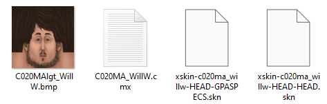
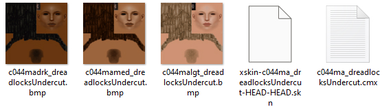

# Sims 1 Files and Files Types 
There's three parts to Create-a-Sim content for *The Sims* (2000):
* The .SKN file (the mesh)
* The .CMX files (what links all the files together)
* The .BMP file (the texture)
## The SKN File
These files are created by importing a .obj file into Skn2Obj, a 3rd party tool created specifically for creating meshes for Sims 1.  

It is important to adhere to the naming conventions Maxis laid out for us so all the files can find each other. This is how the naming of the mesh files (the SKN file) should go:  

`xskin-{b|c}{#}{F|M}{A|C}{shape}_{name}-{attach}-{mesh}`  

Now we'll go through this piece by piece

| Data | Purpose |
| ------ | ------ |
| xskin | Appears on all mesh files |
| {b\|c} | B for Body or C for Cranium (head) |
| # | A 3 digit number |
| {f\|m} | F for female, or M for male |
| {a\|c} | A for adult, or C for child |
| Shape | Fat for fat body, Fit for fit body, Skn for skinny body (leave this out when making heads) |
| Name | A name to distunguish your file |
| attach point | The bone name that your mesh attaches to on the sim body |
| mesh | A description of what your mesh is|  

Let's have a look at a Maxis head to see the naming conventions.  
  
 The Will Wright head has two mesh parts (ie two .skn files): The head, and the glasses.  
```sh
xskin-c020ma_willw-HEAD-HEAD
```
```sh
xskin-c020ma_willw-HEAD-GPASPECS
```
From looking at these .skn file names, you can tell that: 
1. It is a head (c for cranium)
   - xskin-**c**020ma_willw-HEAD-HEAD
2. It is for male adults (ma following the three digits)
   - xskin-c020**ma**_willw-HEAD-HEAD
3. Both meshes attach to the head bone (the HEAD attach point following the mesh name)
   - xskin-c020ma_willw-**HEAD**-HEAD
   - xskin-c020ma_willw-**HEAD**-GPASPECS
4. One mesh is the actual head mesh, the other is a pair of glasses (they are named HEAD and GPASPECS respectively)
    - xskin-c020ma_willw-HEAD-**HEAD**
   - xskin-c020ma_willw-HEAD-**GPASPECS**

You can tell these two meshes go together because of the identifying digits and name given to the mesh: `c020` and `willw`. 

>***This part of the file name is very important!*** These create the name of the mesh group, and this is what the name of the .CMX file will be! This is also what you will name your texture files. For example: The .BMP texture file for the Will Wright head is called C020MAlgt_WillW.bmp. The .CMX file for the Will Wright head is called the same as the mesh group name, C020MA_WillW.cmx. Every file related to this particular Will Wright head will have `c020` and `willw` in the file name.


## The CMX File
These files are created by opening notepad and saving the file as a .cmx file.  
Let's look at a couple of CMX files to see how they are structured. This is the CMX data associated with the Will Wright head (a file that was created for *The Sims* in 1999!):

| Data | Purpose |
| ------ | ------ |
| // Character File. Copyright 1997, Maxis Inc. | Header |
| version 300 | Version |
| 0 |  |
| 1 | Number of Mesh Groups (Always 1) |
| c020ma_willw | Name of Mesh Group|
| 0 |  |
| 0 |  |
| 2 |Number of Meshes in Mesh Group|
| HEAD | Attach Points |
|xskin-c020ma_willw-HEAD-HEAD| Name of Mesh|
| 0 |  |
| 0 |  |
| HEAD | Attach Points |
| xskin-c020ma_willw-HEAD-GPASPECS| Name of 2nd Mesh|
| 0 |  |
| 0 |  |
| 0 |Ending 0|

This head is made up of two mesh parts: The head, and the glasses mesh, so the Number of Meshes in the Mesh Group is two, and the names of both .SKN files follow.

Here is a template for your own head's .CMX file. All you need to do is fill in your mesh names, and add extra lines for your meshes if you have more than one:
```sh
// Character File. Copyright 1997, Maxis Inc.
version 300
0
1
[YOUR MESH GROUP NAME HERE]
0
0
1
HEAD
[YOUR .SKN FILE NAME HERE]
0
0
0
```
## The BMP File
Your textures for Sims 1 CC must always be 8-bit indexed BMP. They will not show correctly in-game unless they are 8-bit BMPs. They must also be in powers of two. Maxis head textures are 128x128, and body textures are 256x256, but they don't have to be. You can have 256px head texures and I've even seen 256x512 sized body textures for certain pieces of CC.  

Sims 1 has three skintones: light, medium, and dark. Head and body textures must have the codes for these skintones in the file name for them to show up in the correct category. For example, the Will Wright head only comes in light skintone, so the file name is C020MA**lgt**_WillW.bmp. If you wanted to create medium and dark textures to attach themselves to the Will Wright mesh, you would simply just need to create indexed BMPs with the file names C020MA**med**_WillW.bmp and C020MA**drk**_WillW.bmp. Here's a head I created in the past that has all three skintones available:  
  
Notice the skintone codes following the three mesh group name digits.

[Home](README.md) | [Tools](tools.md) | [Meshing, Textures, and UV Mapping](meshing.md)

